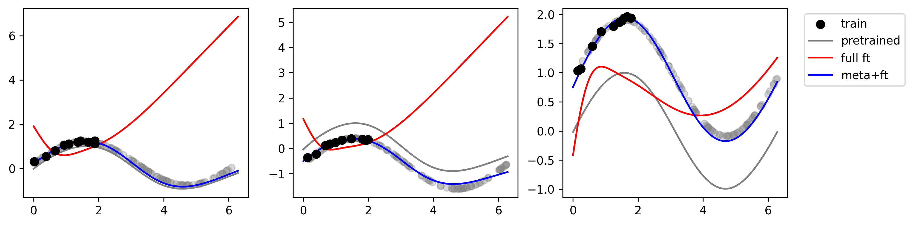

# Meta-Learning a Robust Optimizer for Fine-Tuning

### Toy Sinewave Tasks
 

ES
- https://github.com/openai/evolution-strategies-starter
- https://github.com/SimonBlanke/Gradient-Free-Optimizers
- https://github.com/google/learned_optimization/blob/main/learned_optimization/outer_trainers/full_es.py

Torch optimizers
- https://pytorch.org/docs/stable/_modules/torch/optim/sgd.html#SGD
- https://github.com/rahulkidambi/AccSGD/blob/master/AccSGD.py
- https://github.com/kach/gradient-descent-the-ultimate-optimizer/blob/main/src/gradient_descent_the_ultimate_optimizer/gdtuo.py
- https://github.com/clovaai/AdamP/blob/master/adamp/adamp.py
